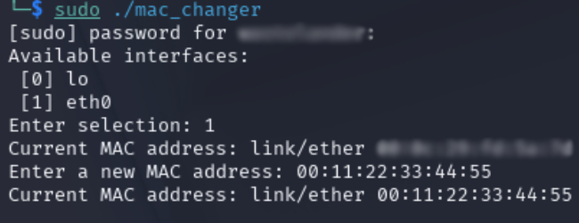
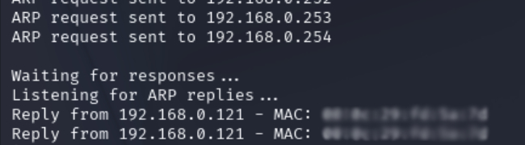
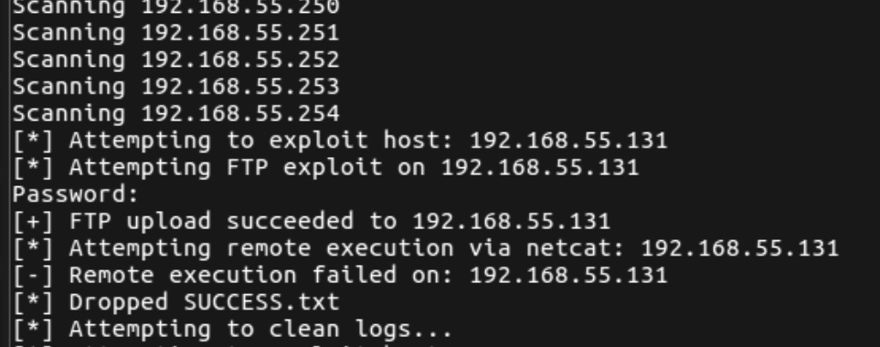

# Networking and Ethical Hacking Tools (C++)

This repository contains networking tools written in modern C++ as part of my path to learning programming and ethical hacking. These projects have given me an understanding of Layer 2 networking (Ethernet/ARP), packet structures, byte manipulation and command-line tool development.

### 1. `mac_changer.cpp` — MAC Address Changer

A command-line tool that allows the user to:
- View a list of available network interfaces;
- Select an interface from the list;
- View current MAC address;
- Designate a new MAC address for the selected interface.

**Key Learning:**
- Parsing shell command output;
- Using `popen()`/`pclose()`, `fgets()` and `regex` to process interface data.

**Usage:**
```bash
g++ mac_changer.cpp -o mac_changer
sudo ./mac_changer
```



### 2. `network_scanner.cpp` — ARP-Based Network Scanner

A command-line tool that scans local `/24` subnet for active hosts by:
- Generating raw ARP request packets using raw sockets;
- Sending requests to each IP in local subnet;
- Capturing ARP replies using `libpcap`;
- Displaying IP, MAC and Vendor of responding devices.

**Key Learning:**
- Building raw Ethernet + ARP packets;
- Using `ioctl()` and `AF_PACKET` sockets;
- Applying BPF filters with `libpcap`;
- Using a .json file for vendor data;
- Understanding subnetting and IP manipulation at the byte level.

**Usage:**
```bash
g++ network_scanner.cpp -o network_scanner -lpcap
sudo ./network_scanner eth0
```



### 3. `worm_WIP.cpp` — Self-Propagating Worm (WORK IN PROGRESS)

A worm program that:
- Scans local host subnet for potential targets using ping;
- Attempts an FTP connection against first target;
- Copies a version of the worm to the target over FTP;
- Cleans log files on target system;
- Remotely executes the newly copied worm, treating the target as a new host from which to propagate and seeking out a seconday target on a separate VLAN.

**Key Learning:**
- More usage of `system()` for CL commands;
- More struct `ifaddrs`, `getifaddrs()` and `freeifaddrs()` for obtaining interface data;
- Extensive use of VMWare for custom VLAN lab setup;
- Custom Docker container for compiling the worm_WIP.cpp with older libraries (in order to match the older vulnerable target machines);
- FTP connection / file sharing.

**Usage:**
```bash
g++ worm_WIP.cpp -o worm_WIP
./worm_WIP
```



**Disclaimer:**
These tools are for educational and testing purposes on networks owned by the operator. Do not use them against systems without explicit permission.
