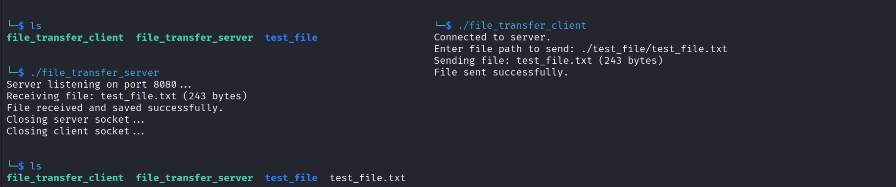

# Basics / Training

This repository contains simple TCP server/client programs.

### 1. TCP Echo (C++)
`echo_server.cpp` `echo_client.cpp`

A command-line tool that:
- Runs a server that accepts client socket connection;
- Receives messages from client, then echoes the message back to the client.

**Key Learning:**
- More socket creation utilizing `socket()`, `connect()`, `accept()`, `listen()`, `send()`, `recv()` etc.

**Usage:**
```bash
g++ echo_server.cpp -o echo_server
g++ echo_client.cpp -o echo_client
./echo_server
./echo_client
```


### 2. TCP Multi-client Chatroom (C++)
`chatroom_server.cpp` `chatroom_client.cpp`

A command-line based TCP chatroom that:
- Utilizes muilt-threading to accept multiple concurrent clients;
- Broadcasts all messages sent by clients to all other clients;
- Allows graceful client exit with `/exit`;
- Allows administrator commands to `/kick` a client or `/list` list all connected clients.

**Key Learning:**
- Multi-threading (`std::thread`) and thread safety (`std::mutex` / `std::lock_guard`);
- More work with socket creation and management.

**Usage:**
```bash
g++ -pthread chatroom_server.cpp -o chatroom_server
g++ -pthread chatroom_client.cpp -o chatroom_client
./chatroom_server
./chatroom_client
```


### 3. TCP File Transfer (C++)
`file_transfer_server.cpp` `file_transfer_client.cpp`

A command-line based TCP file transfer program that:
- Opens a connection between a server and a client on port 8080;
- Asks user to designate a local file to transfer;
- Extracts metadata from local client file and sends metadata + file to server;
- Receives metadata and file and saves to local server disk.

**Key Learning:**
- Stream functions like `fopen()`, `fclose()`, `fseek()`, `ftell()`, `rewind()` and `fread()`.

**Usage:**
```bash
g++ file_transfer_server.cpp -o file_transfer_server
g++ file_transfer_client.cpp -o file_transfer_client
./file_transfer_server
./file_transfer_client
```



### 4. Raw ICMP Ping (C++)
`raw_icmp_ping.cpp`

A command-line based tool that:
- Sets up a raw socket;
- Generates an ICMP packet;
- Sends the packet to Google DNS (8.8.8.8);
- Captures, parses and displays the response.

**Key Learning:**
- Packet crafting.

**Usage:**
```bash
g++ raw_icmp_ping.cpp -o raw_icmp_ping
sudo ./raw_icmp_ping
```


