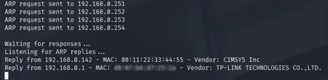

### 1. ARP-Based Network Scanner
`arp_scanner.cpp` `arp_scanner_oui.json`

A command-line tool that scans local `/24` subnet for active hosts by:
- Generating raw ARP request packets using raw sockets;
- Sending requests to each IP in local subnet;
- Capturing ARP replies using `libpcap`;
- Displaying IP, MAC and Vendor of responding devices.

**Key Learning:**
- Building raw Ethernet + ARP packets;
- Using `ioctl()` and `AF_PACKET` sockets;
- Applying BPF filters with `libpcap`;
- Using a .json file for vendor data;
- Understanding subnetting and IP manipulation at the byte level.

**Usage:**
```bash
g++ -lpcap arp_scanner.cpp -o arp_scanner
sudo ./arp_scanner <interface>
```



### 2. Port Scanner
`port_scanner.cpp` `port_scanner_port_lists.h`

A command-line tool that scans one or more hosts for open TCP/UDP ports by:
- Accepting a single IP or a file with a list of targets;
- Scanning top 1000 or full port range using TCP connect() or UDP datagrams;
- Sped up scanning using a thread pool;
- Optionally grabbing banners from open TCP ports;
- Outputting results to console or a .txt file.

**Key Learning:**
- TCP port scanning with `connect()` and timeouts;
- Sending UDP datagrams and interpreting ICMP responses;
- Using a custom thread pool;
- Using `sockaddr_in`, `setsockopt()`, and `inet_pton()` APIs;
- Managing concurrency and shared data with `std::mutex`.

**Usage:**
```bash
g++ port_scanner.cpp -o port_scanner
./port_scanner <target IP> <options [--targets-file targets.txt | target_ip] [--top-1000 | --full] [--UDP] [--banner] [--output-file file.txt]
EXAMPLE: ./port_scanner 192.168.1.1 --top-1000 --banner --output-file results.txt
```
