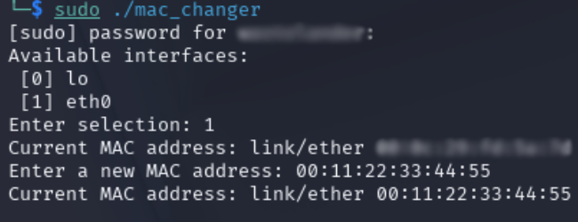
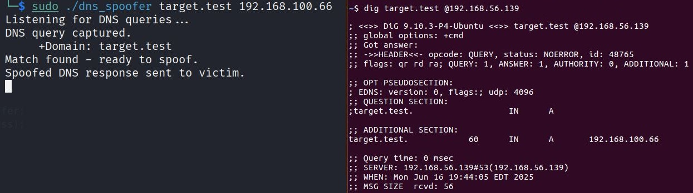

### 1. MAC Address Changer
`mac_changer.cpp`

A command-line tool that allows the user to:
- View a list of available network interfaces;
- Select an interface from the list;
- View current MAC address;
- Designate a new MAC address for the selected interface.

**Key Learning:**
- Parsing shell command output;
- Using `popen()`/`pclose()`, `fgets()` and `regex` to process interface data.

**Usage:**
```bash
g++ mac_changer.cpp -o mac_changer
sudo ./mac_changer
```



### 2. DNS Spoofer
`dns_spoofer.cpp`

A command-line tool that:
- Monitors incoming UDP port 53 traffic (DNS queries);
- Identifies DNS requests for a user-defined domain;
- Crafts and sends forged DNS A record replies to the victim.

**Key Learning:**
- Parsing retreived packets;
- Creating RAW UDP packets while using `setsockopt()`.

**Usage:**
```bash
g++ dns_spoofer.cpp -o dns_spoofer
sudo ./dns_spoofer <target_domain> <spoofed_IP>
```


