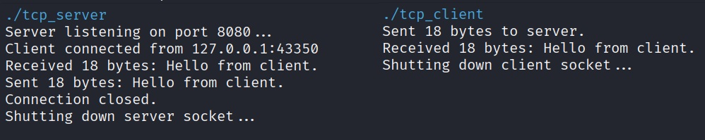

# TCP Echo Server/Client (C++)

This repository contains a simple TCP server that echoes any messages sent from the client over port 8080.

**Key Learning:**
- More socket creation utilizing `socket()`, `connect()`, `accept()`, `listen()`, `send()`, etc.

**Usage:**
```bash
g++ tcp_server.cpp -o tcp_server
g++ tcp_client.cpp -o tcp_client
sudo ./tcp_server
sudo ./tcp_client
```


